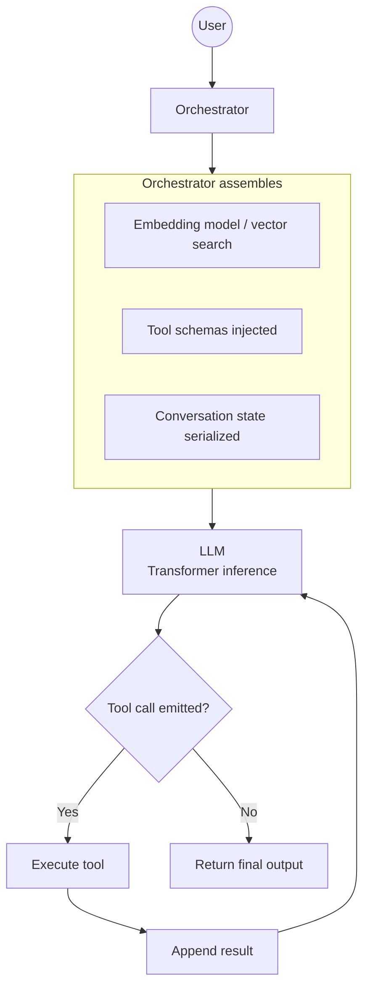

# Foundations: Prompt Engineering

## Introduction

Prompt engineering is not about clever wording.

It is about **controlling the model’s inference loop** by shaping the token sequence that enters the transformer.

Modern SDKs expose this through:

* `system` messages
* `user` messages
* `assistant` messages
* tool schemas
* embeddings + retrieval pipelines
* structured output constraints

Under the hood, all of this becomes **tokens in a single context window**, and the model performs next-token prediction.

Prompt engineering is the practice of controlling that process.

---

# 1. What Actually Happens to System and User Prompts?

A modern chat API call like:

```json
[
  {"role": "system", "content": "You are a precise technical assistant."},
  {"role": "user", "content": "Explain transformers simply."}
]
```

is internally converted into a **single serialized token sequence**.

Conceptually:

```
<|system|>
You are a precise technical assistant.
<|user|>
Explain transformers simply.
<|assistant|>
```

The transformer does not “understand roles.”

It sees **tokens in sequence**.

However, special role tokens were present during training. The model learned patterns such as:

* System → high-authority instruction
* User → request or task
* Assistant → continuation response

Roles are not logic — they are **learned behavioral priors**.

---

## Why System Messages Feel Stronger

During training, system-like instructions frequently defined behavior at the beginning of conversations.

So the model learned a statistical pattern:

> Tokens following a system block should obey it.

There is no internal rule engine.
There is only probability shaped by training data.

---

# 2. What the Model Actually Sees

The full context window becomes:

```
[System tokens]
[User tokens]
[Previous assistant tokens]
[Tool results]
[Retrieved documents]
...
```

All concatenated into one sequence.

The transformer:

1. Converts tokens → embeddings
2. Adds positional encoding
3. Runs masked self-attention over the entire sequence
4. Predicts the next token

Everything is context.

---

# 3. Prompt Engineering = Probability Engineering

The model computes:

[
P(\text{next token} \mid \text{all previous tokens})
]

Changing:

* wording
* formatting
* structure
* examples
* ordering
* constraints

changes the conditional distribution.

Prompt engineering is steering that probability surface.

---

# 4. Where Embeddings Fit In

Embeddings operate **outside the main generation model**, but they shape what enters the context window.

There are two primary uses.

---

## A) Retrieval-Augmented Generation (RAG)

Flow:

1. User message → embedding vector
2. Vector search retrieves relevant documents
3. Retrieved text is inserted into context
4. The LLM generates a response

The model does not access a database directly.

It only sees injected context like:

```
<|system|>
You are a helpful assistant.

<|context|>
Document A...
Document B...

<|user|>
Question here...
```

Embeddings determine what context is injected.

Prompt engineering determines:

* how that context is formatted
* how the model is instructed to use it
* how hallucination is constrained

---

## B) Tool Routing and Intent Classification

Embeddings may also be used to:

* classify user intent
* route to workflows
* detect topics
* trigger tool use

This is orchestration logic outside the transformer.

---

# 5. How Tool Calling Actually Works

Tool calling is structured token prediction plus runtime orchestration.

---

## Step 1: Tool Schema Is Injected

The SDK adds something like:

```
You may call the following function:

function get_weather(location: string) -> weather_data
```

This becomes part of the token stream.

---

## Step 2: Model Emits Structured Output

The model predicts something like:

```json
{
  "tool_call": {
    "name": "get_weather",
    "arguments": {"location": "San Francisco"}
  }
}
```

This is next-token prediction over a structured pattern learned during training.

The model does not execute anything.

---

## Step 3: Runtime Executes the Tool

The SDK:

1. Parses structured output
2. Calls the real function
3. Gets result
4. Appends result to the conversation

Example:

```
<|tool_result|get_weather|>
{"temperature": "65F"}
```

---

## Step 4: Model Integrates the Result

Now the model continues generation using the updated context.

Again: next-token prediction.

---

# 6. Modern SDK Architecture (Conceptual)

A typical LLM application loop:



The SDK controls the loop.
The LLM predicts tokens.

---

# 7. What Effective Prompt Engineering Means

### 1. Behavior Framing

Use system messages to define:

* tone
* reasoning style
* safety constraints
* output format

---

### 2. Structure Reduces Entropy

Clear structure narrows output space.

Weak:

> Summarize this.

Stronger:

> Provide exactly 3 bullet points, each under 15 words.

You are constraining the probability distribution.

---

### 3. Constrain Output Explicitly

Use:

* JSON schemas
* structured response formats
* tool-enforced outputs

Lower entropy improves reliability.

---

### 4. Control Context Placement

Order matters.

* Recent tokens have positional influence.
* Attention may weight nearby instructions more strongly.

Place critical constraints:

* late in system prompt
* near the task instruction

---

### 5. Separate Deterministic and Probabilistic Tasks

Let:

* Tools handle deterministic computation (math, database lookups).
* LLM handle language reasoning and synthesis.

Prompt engineering coordinates that boundary.

---

# 8. What Is Really Happening (Summary Table)

| Concept            | What It Actually Is                                   |
| ------------------ | ----------------------------------------------------- |
| System prompt      | High-prior instruction tokens at beginning of context |
| User prompt        | Task tokens appended before generation                |
| Memory             | Serialized conversation history                       |
| RAG                | Retrieved documents injected into context             |
| Tool calling       | Structured token emission                             |
| SDK orchestration  | External control loop                                 |
| Prompt engineering | Shaping token distribution before inference           |

---

# 9. Mental Model

Prompt engineering is not:

> Convincing the model.

It is:

> Engineering the context window to shape the next-token distribution.

You are programming through probability, not rules.

---

# 10. Compact Definition

Prompt engineering is the practice of structuring and controlling the model’s context window — including instructions, examples, retrieved knowledge, and tool schemas — in order to shape the probability distribution over generated tokens.

---
