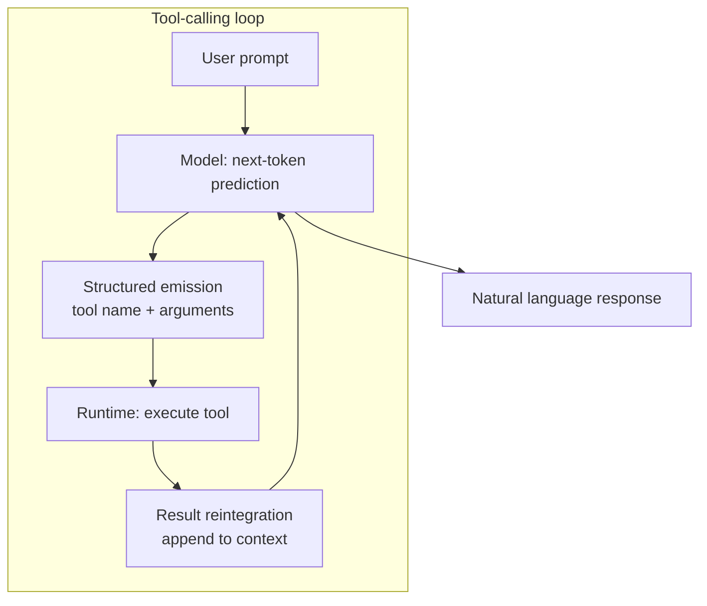
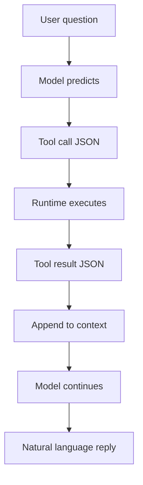
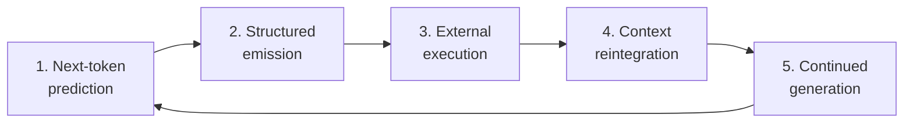

# Foundations: Tool Calling

*(LLM Overview Project)*

---

## Introduction

Tool calling extends the transformer’s core capability — next-token prediction — into the external world.

A modern LLM does not execute code, access APIs, or retrieve real-time data internally. Instead, it learns to emit structured tokens that represent tool invocations. External systems detect those structured outputs, execute the requested operation, and return results to the model as additional context. The model then continues autoregressive generation conditioned on this new information.

Tool use is therefore not a separate reasoning engine or symbolic planner. It is:

> Structured next-token prediction + external execution + context reintegration.

At scale, transformers learn schema adherence, argument binding, and multi-step continuation patterns that make tool use appear deliberate and goal-directed.

---

## Suggested Reading (Brief)

For foundational background relevant to tool calling:

* Vaswani et al., *Attention Is All You Need* (2017) — transformer architecture
* OpenAI Function Calling documentation (2023–2025) — structured output schemas
* Anthropic Tool Use documentation — structured tool integration patterns
* Wei et al., *Chain-of-Thought Prompting* (2022) — multi-step reasoning patterns
* Nye et al., *Show Your Work* (2021) — reasoning traces as latent computation externalization

These provide context for how autoregressive transformers can produce structured reasoning and structured outputs.

---

# Core Concept

Tool calling is not symbolic planning.

It is:

1. Next-token prediction
2. Structured schema emission
3. External runtime execution
4. Context reintegration
5. Continued autoregressive generation

Everything reduces to probabilistic token continuation.



---

# 1. Decision Emerges from Next-Token Prediction

The model does not explicitly decide to call a tool.

Given the context and prompt, it predicts the next most probable token.

If training patterns associate certain queries with tool invocation, the highest-probability continuation becomes a structured call.

### Example: Weather Query

**User Prompt**

> "What’s the weather in San Francisco right now?"

Instead of predicting natural language:

> "The weather in San Francisco is..."

The model predicts structured tokens:

```json
{
  "name": "get_weather",
  "arguments": {
    "city": "San Francisco"
  }
}
```

There is no internal execution.
Just token probability.

---

# 2. Structured Emission

The system provides tool schemas in the context:

```json
{
  "name": "get_weather",
  "description": "Get current weather for a city",
  "parameters": {
    "type": "object",
    "properties": {
      "city": {"type": "string"}
    },
    "required": ["city"]
  }
}
```

The model:

* Attends to "San Francisco"
* Routes that feature into the `"city"` field
* Emits syntactically valid JSON

This works because:

* Transformers track long-range dependencies
* Attention allows argument binding
* Schema tokens constrain valid continuation space

Structured output is learned pattern completion.

---

# 3. Runtime Execution (External System)

After the model emits:

```json
{
  "name": "get_weather",
  "arguments": {
    "city": "San Francisco"
  }
}
```

The runtime:

1. Detects structured tool output
2. Executes `get_weather("San Francisco")`
3. Returns result:

```json
{
  "temperature": "58°F",
  "conditions": "Partly cloudy",
  "wind": "8 mph NW"
}
```

The model does not execute code.

Execution is always external.

---

# 4. Result Reintegration

The tool result is appended to the context window.

Now the model continues next-token prediction conditioned on:

* The original question
* Its tool call
* The tool output

Continuation:

> "It’s currently 58°F in San Francisco with partly cloudy skies and winds at 8 mph from the northwest."

Again: just autoregressive continuation.



---

# Multi-Step Example

### Sales Tax Calculation

**User Prompt**

> "How much would I pay in sales tax if I buy a $2,499 laptop in San Jose?"

The model predicts:

```json
{
  "name": "get_sales_tax_rate",
  "arguments": {
    "city": "San Jose"
  }
}
```

Tool returns:

```json
{
  "rate": 0.0925
}
```

Model emits second tool call:

```json
{
  "name": "calculate_total",
  "arguments": {
    "price": 2499,
    "tax_rate": 0.0925
  }
}
```

Tool returns:

```json
{
  "total": 2729.66
}
```

Model integrates:

> "With a 9.25% sales tax in San Jose, your total would be $2,729.66."

This is iterative structured continuation.

No symbolic reasoning layer exists outside autoregression.

---

# Code Execution Example

### Fibonacci

**User Prompt**

> "Write Python code to compute the first 10 Fibonacci numbers and show the result. Show me your steps including tool commands."

Model emits (Step 1 — write code; Step 2 — run it via tool):

```json
{
  "name": "python_user_visible.exec",
  "arguments": {
    "code": "def first_n_fib(n: int) -> list[int]:\n    fib = []\n    a, b = 0, 1\n    for _ in range(n):\n        fib.append(a)\n        a, b = b, a + b\n    return fib\n\nresult = first_n_fib(10)\nresult"
  }
}
```

Runtime executes.

Returns:

```json
{
  "result": [0, 1, 1, 2, 3, 5, 8, 13, 21, 34]
}
```

Model continues (presenting steps and result):

> Here are the steps (including the tool command I ran) and the Python code.
>
> **Step 1 — Write the code**
>
> ```python
> def first_n_fib(n: int) -> list[int]:
>     fib = []
>     a, b = 0, 1
>     for _ in range(n):
>         fib.append(a)
>         a, b = b, a + b
>     return fib
>
> result = first_n_fib(10)
> result
> ```
>
> **Step 2 — Run it (tool command)**  
> Tool command executed: `python_user_visible.exec` (ran the code above).
>
> **Step 3 — Result**  
> [0, 1, 1, 2, 3, 5, 8, 13, 21, 34]

Again:
Structured tokens → external execution → context continuation.


---

# Fresh Information Example

### News Lookup

**User Prompt**

> "Who won the most recent Super Bowl? Show your steps including tool calls."

Model emits (Step 1 — look it up):

```json
{
  "name": "web.run",
  "arguments": {
    "search_query": "most recent Super Bowl winner",
    "recency": "30 days"
  }
}
```

Tool returns (search results from multiple sources):

```json
{
  "results": [
    {"source": "ESPN", "summary": "Seattle Seahawks win Super Bowl LX, defeat Patriots 29-13"},
    {"source": "NFL.com", "summary": "Super Bowl LX (Feb 8, 2026): Seahawks 29, Patriots 13"},
    {"source": "stats site", "summary": "2026 champion: Seattle Seahawks"}
  ]
}
```

Model integrates (steps + answer):

> **What I did (with tool calls)**
>
> **Step 1 — Look it up on the web**  
> I ran a web search for "most recent Super Bowl winner".  
> Tool call: `web.run` with search_query. Queries used: "most recent Super Bowl winner" (recency: 30 days), "Super Bowl 2026 winner", "Super Bowl 2025 winner" (recency: 365 days).
>
> **Step 2 — Read and cross-check reputable sources**  
> From the returned results, multiple reputable outlets and a stats site agree on the same outcome.
>
> **Answer**  
> The most recent Super Bowl was Super Bowl LX (played February 8, 2026), and the Seattle Seahawks won, defeating the New England Patriots 29–13.

Tool calling enables grounding beyond frozen training data.

---

# Mechanistic Framing

Under a transformer interpretability lens, tool calling involves:

* Feature detection ("requires external capability")
* Schema-conditioned continuation
* Attention-based argument routing
* Residual stream state accumulation
* Multi-step autoregressive planning via context growth

Tool use is:

> A learned continuation circuit operating over structured schemas.

It is not:

* A symbolic planner
* A separate reasoning module
* An internal execution engine

---

# Canonical Summary



Tool calling =

1. Next-token prediction
2. Structured schema emission
3. External execution
4. Context reintegration
5. Continued autoregressive generation

Everything reduces to probabilistic continuation over tokens.

---
