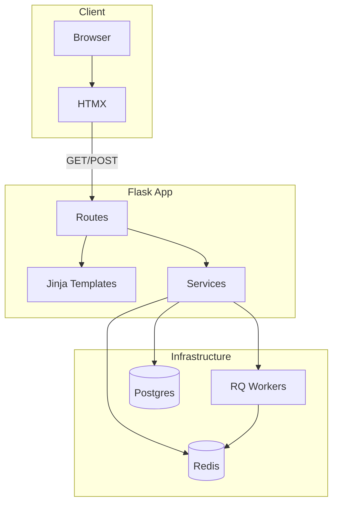
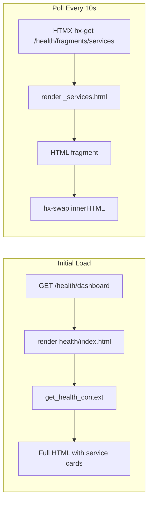
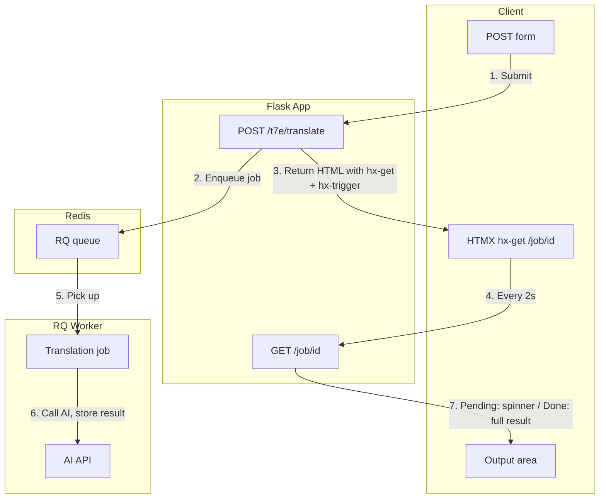
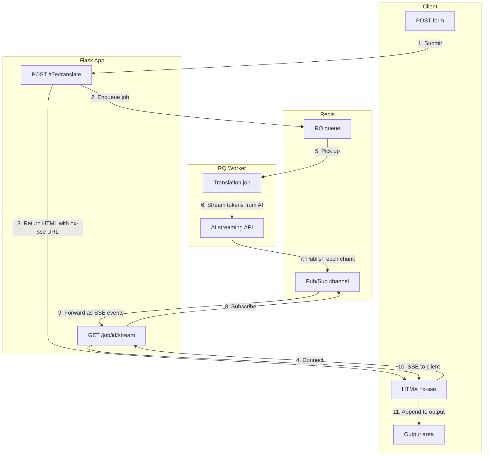

# (mw)² Application Design

## Introduction

This document describes the high-level design of the (mw)² application: a learning-focused example site that demonstrates modern, minimal web development with Flask, HTMX, and CSS.

### Goals

- **Mobile-first:** Layout optimized for touch and small screens; scales up for desktop. Responsive across all devices.
- **Minimal JavaScript:** Use HTMX for dynamic behavior. No custom JS for polling, streaming, or DOM updates.
- **Streaming support:** Translation and AI features support streaming input (debounced) and streaming output (token-by-token).
- **AI engineering principles:** Demonstrate core patterns: async jobs, streaming responses, Redis pub/sub, RQ workers.
- **Minimalistic:** Clean structure, restrained styling. Interesting without being heavy.
- **Learning-oriented:** Clear separation of concerns for easier review and understanding.

---

## High-Level Design

**Stack:** Flask, Jinja2, HTMX, modular CSS, Redis, RQ, Postgres.

---

## Component Sections

### 1. CSS – Implementation Base and Visual Reference

**Implementation base: Pico CSS**
- Minimal CSS for semantic HTML. Works with pure markup; no JavaScript.
- Responsive typography and spacing by default. Class-light; few custom classes.
- Light/dark mode via `prefers-color-scheme` without JavaScript.
- Over 130 CSS variables for customization. Lean HTML, low specificity.

**Visual reference: [Modern Digital Portfolio – No JS](https://github.com/Sohail7739/web-design-portfolio-no-js)**
- Aesthetic inspiration: gradients, glassmorphism, hover motion.
- Built with HTML + CSS only; CSS Grid, Flexbox, CSS custom properties.
- Mobile-first, responsive, touch-optimized.

**Approach:** Pico CSS as base. `main.css` for overrides, status components (`.card[data-status="pass"|"warn"|"fail"]`, `.status-dot`, `.badge`), and visual refinements (gradients, glassmorphism, transitions) inspired by the portfolio reference.

**Look and feel:** See [Look and Feel Requirements](#look-and-feel-requirements) below.

### 2. Templates – Jinja Structure

- **base.html:** Layout shell, nav, footer, CSS/script includes, `` for title, head, content, scripts.
- **Partials:** `_macros.html` for `service_card` macro. `_services.html` for the services list. Both used by full page and fragment endpoint. Cards use `data-status="pass"|"warn"|"fail"`.
- **Inheritance:** Page templates extend `base.html` and fill blocks. Server is the single source of truth for markup.

### 3. Routes – Flask Blueprints

- **root:** Home page.
- **health:** Dashboard at `/health/dashboard`; fragment endpoint for HTMX polling.
- **t7e:** Translation example; form submission, job creation, SSE stream.
- **health_api** (prefix `/mw2/v1`): `/mw2/v1/status` (JSON for dashboard polling), `/mw2/v1/health` (IETF health check).

### 4. Services – Business Logic

- **health:** `get_health_context()` from `utils.health.run_checks` – returns `health_results` list of `{component_name, status, description}`. Status: `pass`, `warn`, `fail`. Health checks registered via `@health_check` (redis, postgres, pgvector, rq, ai).
- **translation:** Job creation, AI client calls, streaming coordination.

### 5. HTMX – Declarative Interactivity

- **Polling:** `hx-get`, `hx-trigger="every 10s"`, `hx-swap="innerHTML"` for health services.
- **Forms:** `hx-post` for translation submit; response includes `hx-sse` for streaming.
- **SSE:** `hx-sse` connects to job stream; HTMX appends chunks to output.
- **Input:** `hx-trigger="input changed delay:300ms"` for debounced live translation.

### 6. RQ + Redis – Async Jobs

- **Job queue:** Translation requests enqueued; workers process in background.
- **Redis pub/sub:** Worker publishes tokens to a job-specific channel as AI streams.
- **Bridge:** Flask SSE endpoint subscribes to Redis and forwards to client.

---

## Look and Feel Requirements

**Typography**
- Body: Outfit (Google Fonts). Fallback: system-ui, sans-serif.
- Code/data: JetBrains Mono. Fallback: monospace.
- Headings: bold, tight tracking.
- Secondary text: smaller mono, muted colour.

**Colour palette**
- Neutral palette for text, borders, backgrounds.
- Status: pass = emerald (borders, bg, text); warn = amber; fail = stone/muted.
- Accent: sky for badges.
- Page background: gradient (e.g. stone-100 → white → amber-50). Compatible with light/dark via `prefers-color-scheme`.

**Layout**
- Mobile-first. Min-height 100vh.
- Content: max-width ~42rem, centred, responsive padding.
- CSS Grid and Flexbox for structure. Responsive typography and spacing.

**Components**
- Cards: rounded, border, padding, flex with gap. Status via `data-status="pass"|"warn"|"fail"`.
- Status dot: ~12px, rounded-full. Colour by status.
- Badge: rounded, small padding, mono.
- Nav links: medium weight, darker on hover.

**Interaction**
- Focus: 2px outline, 2px offset (accessibility).
- Transitions for hover/focus. Subtle box-shadow changes.
- Optional: glassmorphism (backdrop-filter) for cards or overlays.
- Heading superscript (mw)²: reduced size, super alignment.

---

## Use Cases

Three patterns for dynamic content. All use HTMX; no WebSockets.

| Use Case | Method | Protocol |
|----------|--------|----------|
| 1. Health polling | HTMX `hx-get` + `hx-trigger="every 10s"` | HTTP polling |
| 2. POST → poll for full result | HTMX `hx-get` + `hx-trigger="every 2s"` | HTTP polling |
| 3. Streaming results | HTMX `hx-sse` | SSE (HTTP-based) |

### Use Case 1: Health Polling (No User Input)

Fetch updated status on a fixed interval. No form submission.

- **Method:** HTMX + HTTP polling
- **Attributes:** `hx-get`, `hx-trigger="every 10s"`, `hx-swap="innerHTML"`
- **Flow:** Each request is a normal HTTP GET; server returns HTML fragment; HTMX swaps it in.

### Use Case 2: POST → Background Job → Poll for Full Result

User submits a form; a background job runs; client polls until complete, then displays the full result.

- **Method:** HTMX + HTTP polling
- **Flow:** POST creates job, returns HTML with a polling element. That element has `hx-get="/job/{id}"` and `hx-trigger="every 2s"`. Each GET returns either "Processing…" or the full result when done.
- **Why not WebSockets:** Polling is sufficient; WebSockets add complexity without benefit.

### Use Case 3: Streaming Results

User types or starts a job; results appear incrementally as the backend produces them.

- **Method:** HTMX + SSE (Server-Sent Events)
- **Flow:** POST creates job, returns HTML with `hx-sse="connect:/job/{id}/stream"`. HTMX opens SSE connection. Server streams events as tokens arrive. HTMX appends each to the output.
- **Why not WebSockets:** SSE is one-way (server→client), simpler, and works natively with HTMX.

---

## Data Flow: Use Case 1 – Health Page

1. **Initial load:** User requests `/health/dashboard`. Flask renders full page with service cards from `get_health_context()` (returns `health_results`).
2. **Polling:** A div has `hx-get`, `hx-trigger="every 10s"`, `hx-swap="innerHTML"`. HTMX fetches `/health/fragments/services` every 10 seconds.
3. **Fragment:** Fragment route renders `_services.html` with `health_results` from `get_health_context()`. Same Jinja partial as initial render.
4. **Swap:** HTMX replaces the div content with the new fragment. No custom JavaScript.

---

## Data Flow: Use Case 2 – Poll for Full Result

1. **Submit:** User submits form. `POST /t7e/translate` creates an RQ job and returns HTML with a div that has `hx-get="/job/{job_id}"` and `hx-trigger="every 2s"`.
2. **Polling:** HTMX fetches `/job/{job_id}` every 2 seconds.
3. **Response:** If the job is still running, the server returns a "Processing…" fragment. If complete, it returns the full result.
4. **Swap:** HTMX replaces the div content. User sees the result when the job finishes.

---

## Data Flow: Use Case 3 – Translation Job (Streaming)

1. **Submit:** User submits translation form. `POST /t7e/translate` creates an RQ job and returns HTML that includes `hx-sse="connect:/job/{job_id}/stream"`.
2. **HTMX connects:** HTMX opens an SSE connection to `/job/{job_id}/stream`.
3. **Worker runs:** RQ worker executes the job, calls the AI API, and receives a streaming response.
4. **Publish:** For each token, the worker publishes to Redis: `redis.publish(f"job:{job_id}", chunk)`.
5. **Flask subscribes:** The SSE endpoint subscribes to `job:{job_id}` via Redis pub/sub.
6. **Stream to client:** Flask receives chunks from Redis, formats them as SSE events (`data: ...\n\n`), and yields to the client.
7. **HTMX updates:** HTMX receives each event and appends the content to the output area.

**Streaming input:** For live translation as the user types, the form uses `hx-trigger="input changed delay:300ms"` to send the current value after 300ms of inactivity. The server creates a new job for each debounced submission.
