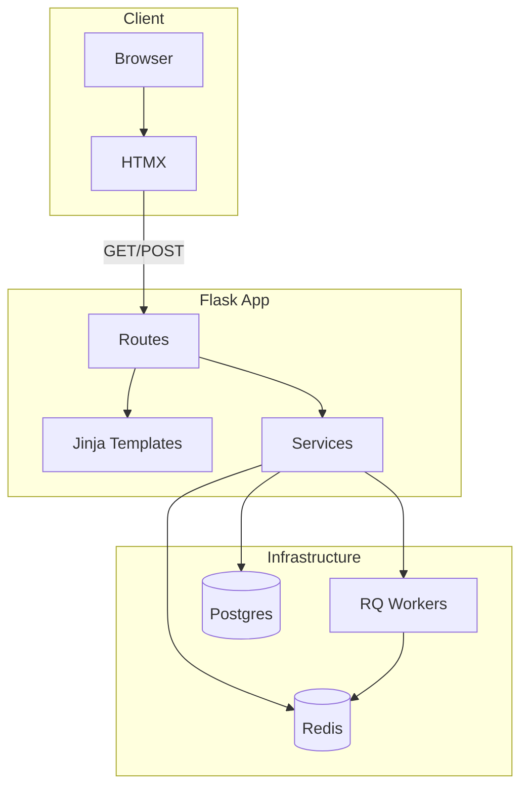
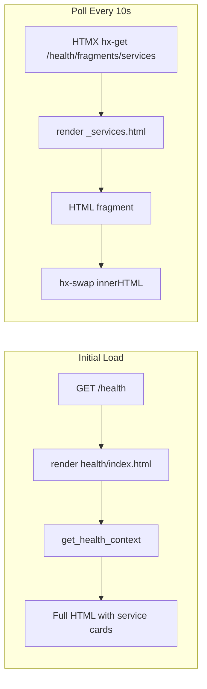
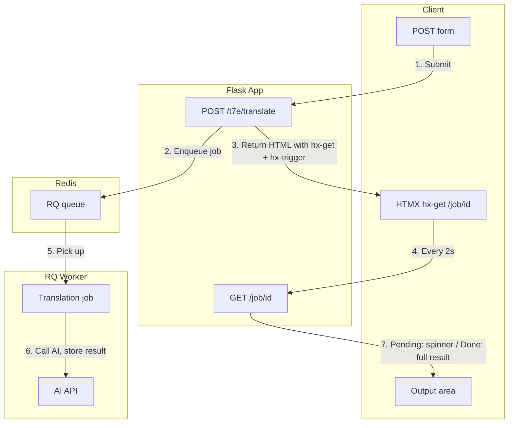
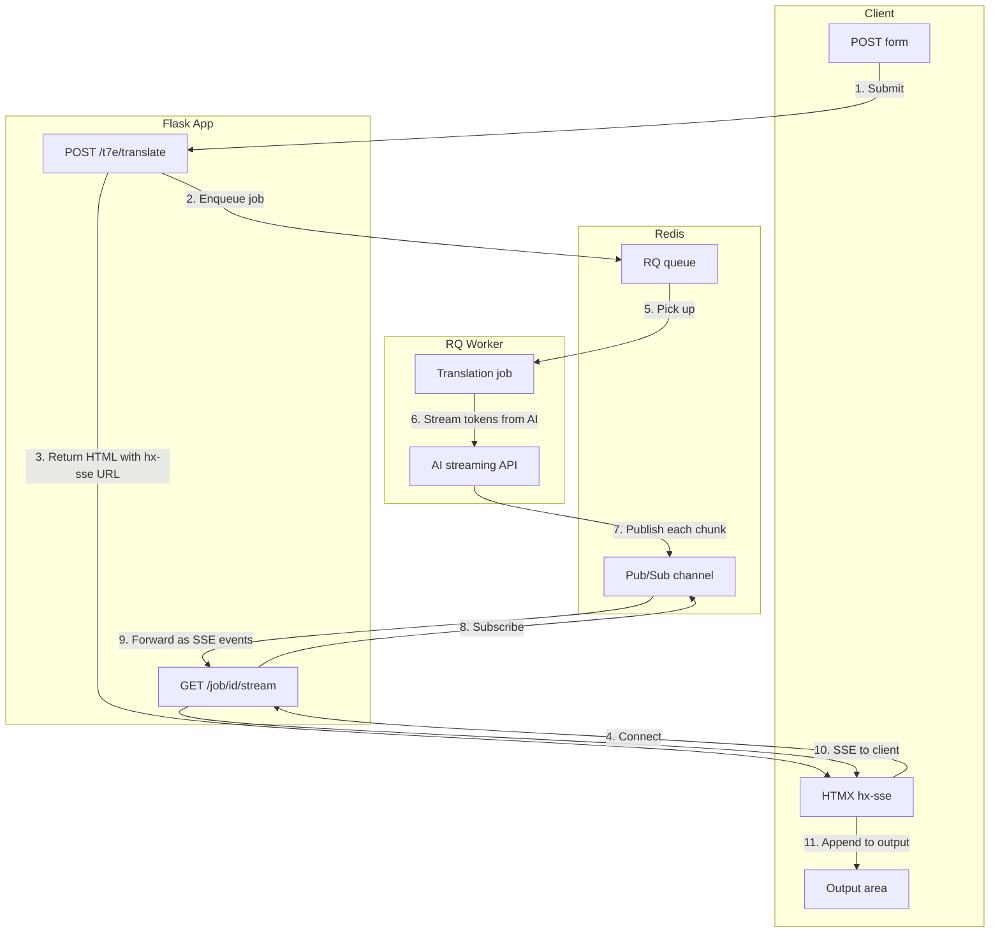

# (mw)² Application Design

## Introduction

This document describes the high-level design of the (mw)² application: a learning-focused example site that demonstrates modern, minimal web development with Flask, HTMX, and CSS.

### Goals

- **Mobile-first:** Primary target is mobile; desktop is supported. Responsive layout using CSS only.
- **Minimal JavaScript:** Use HTMX for dynamic behavior. No custom JS for polling, streaming, or DOM updates.
- **Streaming support:** Translation and AI features support streaming input (debounced) and streaming output (token-by-token).
- **AI engineering principles:** Demonstrate core patterns: async jobs, streaming responses, Redis pub/sub, RQ workers.
- **Modern simplistic design:** Hand-written CSS utilities, no framework. Structure that supports AI-assisted CSS maintenance.
- **Learning-oriented:** Modular CSS and clear separation of concerns for easier review and understanding.

---

## High-Level Design

**Stack:** Flask, Jinja2, HTMX, modular CSS, Redis, RQ, Postgres. No JavaScript framework.

---

## Component Sections

### 1. CSS – Modular Utility Layer

A hand-written semantic utility layer (Pico.css-style), split into separate files for clarity and learning.

| File | Purpose |
|------|---------|
| `variables.css` | Design tokens: colors, spacing, typography |
| `layout.css` | Container, grid, responsive breakpoints |
| `components.css` | Reusable UI: `.card`, `.card--on`, `.badge`, `.btn`, `.status-dot` |
| `utilities.css` | Helpers: `.text-muted`, etc. |
| `site.css` | Overrides, focus styles, app-specific tweaks |

**Inclusion:** Multiple `<link>` tags in `base.html` in dependency order. Each file has a brief comment block explaining its role.

**Modern look:** Typography (Outfit, JetBrains Mono), CSS variables for theming, `clamp()` for responsive spacing, `transition` for micro-interactions. Status components use `data-status="on"` / `data-status="off"` for state-based styling.

### 2. Templates – Jinja Structure

- **base.html:** Layout shell, nav, footer, CSS/script includes, `` for title, head, content, scripts.
- **Partials:** `_macros.html` for reusable fragments (e.g. `service_card`). `_services.html` for the services list used by both full page and fragment endpoint.
- **Inheritance:** Page templates extend `base.html` and fill blocks. Server is the single source of truth for markup.

### 3. Routes – Flask Blueprints

- **root:** Home page.
- **health:** Health status page; fragment endpoint for HTMX polling.
- **t7e:** Translation example; form submission, job creation, SSE stream.
- **api:** JSON endpoints where needed (e.g. `/api/status` for external consumers).

### 4. Services – Business Logic

- **health:** `get_health_context()`, `get_services_list()` – Redis, Postgres, pgvector, RQ, AI status.
- **translation:** Job creation, AI client calls, streaming coordination.

### 5. HTMX – Declarative Interactivity

- **Polling:** `hx-get`, `hx-trigger="every 10s"`, `hx-swap="innerHTML"` for health services.
- **Forms:** `hx-post` for translation submit; response includes `hx-sse` for streaming.
- **SSE:** `hx-sse` connects to job stream; HTMX appends chunks to output.
- **Input:** `hx-trigger="input changed delay:300ms"` for debounced live translation.

### 6. RQ + Redis – Async Jobs

- **Job queue:** Translation requests enqueued; workers process in background.
- **Redis pub/sub:** Worker publishes tokens to a job-specific channel as AI streams.
- **Bridge:** Flask SSE endpoint subscribes to Redis and forwards to client.

---

## Use Cases

Three patterns for dynamic content. All use HTMX; no WebSockets.

| Use Case | Method | Protocol |
|----------|--------|----------|
| 1. Health polling | HTMX `hx-get` + `hx-trigger="every 10s"` | HTTP polling |
| 2. POST → poll for full result | HTMX `hx-get` + `hx-trigger="every 2s"` | HTTP polling |
| 3. Streaming results | HTMX `hx-sse` | SSE (HTTP-based) |

### Use Case 1: Health Polling (No User Input)

Fetch updated status on a fixed interval. No form submission.

- **Method:** HTMX + HTTP polling
- **Attributes:** `hx-get`, `hx-trigger="every 10s"`, `hx-swap="innerHTML"`
- **Flow:** Each request is a normal HTTP GET; server returns HTML fragment; HTMX swaps it in.

### Use Case 2: POST → Background Job → Poll for Full Result

User submits a form; a background job runs; client polls until complete, then displays the full result.

- **Method:** HTMX + HTTP polling
- **Flow:** POST creates job, returns HTML with a polling element. That element has `hx-get="/job/{id}"` and `hx-trigger="every 2s"`. Each GET returns either "Processing…" or the full result when done.
- **Why not WebSockets:** Polling is sufficient; WebSockets add complexity without benefit.

### Use Case 3: Streaming Results

User types or starts a job; results appear incrementally as the backend produces them.

- **Method:** HTMX + SSE (Server-Sent Events)
- **Flow:** POST creates job, returns HTML with `hx-sse="connect:/job/{id}/stream"`. HTMX opens SSE connection. Server streams events as tokens arrive. HTMX appends each to the output.
- **Why not WebSockets:** SSE is one-way (server→client), simpler, and works natively with HTMX.

---

## Data Flow: Use Case 1 – Health Page

1. **Initial load:** User requests `/health`. Flask renders full page with service cards from `get_health_context()`.
2. **Polling:** A div has `hx-get`, `hx-trigger="every 10s"`, `hx-swap="innerHTML"`. HTMX fetches `/health/fragments/services` every 10 seconds.
3. **Fragment:** Fragment route renders `_services.html` with current status. Same Jinja partial as initial render.
4. **Swap:** HTMX replaces the div content with the new fragment. No custom JavaScript.

---

## Data Flow: Use Case 2 – Poll for Full Result

1. **Submit:** User submits form. `POST /t7e/translate` creates an RQ job and returns HTML with a div that has `hx-get="/job/{job_id}"` and `hx-trigger="every 2s"`.
2. **Polling:** HTMX fetches `/job/{job_id}` every 2 seconds.
3. **Response:** If the job is still running, the server returns a "Processing…" fragment. If complete, it returns the full result.
4. **Swap:** HTMX replaces the div content. User sees the result when the job finishes.

---

## Data Flow: Use Case 3 – Translation Job (Streaming)

1. **Submit:** User submits translation form. `POST /t7e/translate` creates an RQ job and returns HTML that includes `hx-sse="connect:/job/{job_id}/stream"`.
2. **HTMX connects:** HTMX opens an SSE connection to `/job/{job_id}/stream`.
3. **Worker runs:** RQ worker executes the job, calls the AI API, and receives a streaming response.
4. **Publish:** For each token, the worker publishes to Redis: `redis.publish(f"job:{job_id}", chunk)`.
5. **Flask subscribes:** The SSE endpoint subscribes to `job:{job_id}` via Redis pub/sub.
6. **Stream to client:** Flask receives chunks from Redis, formats them as SSE events (`data: ...\n\n`), and yields to the client.
7. **HTMX updates:** HTMX receives each event and appends the content to the output area.

**Streaming input:** For live translation as the user types, the form uses `hx-trigger="input changed delay:300ms"` to send the current value after 300ms of inactivity. The server creates a new job for each debounced submission.
